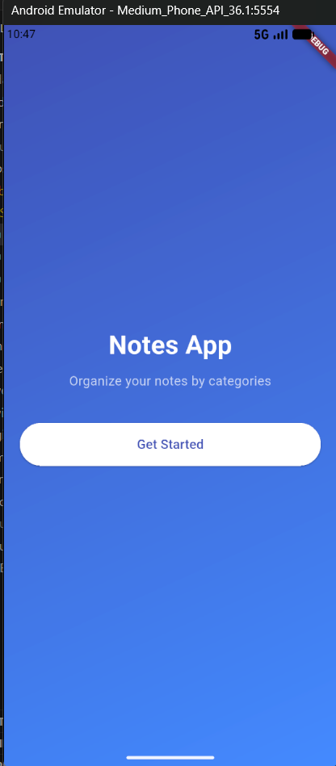
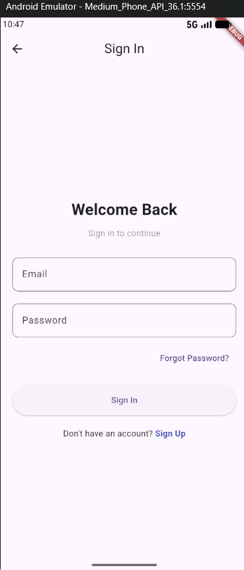
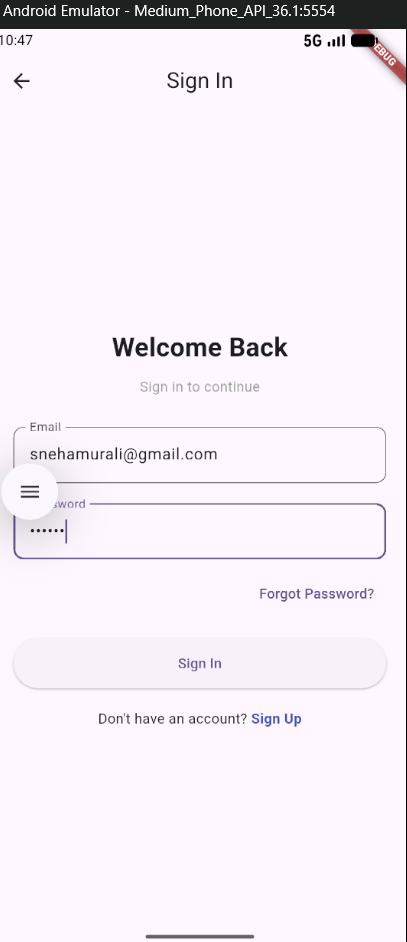
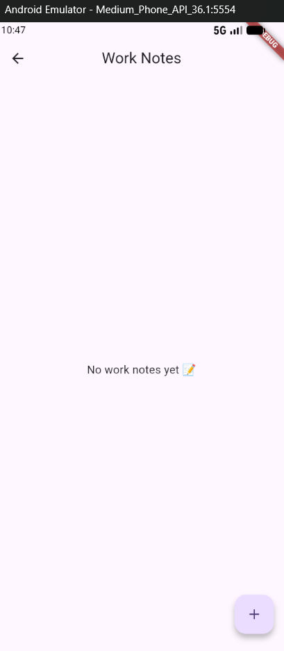
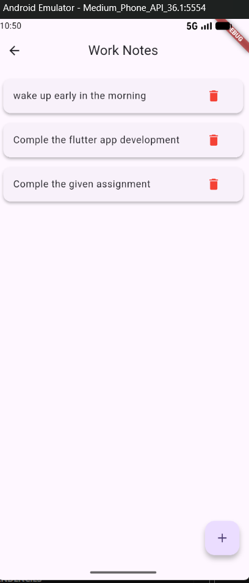
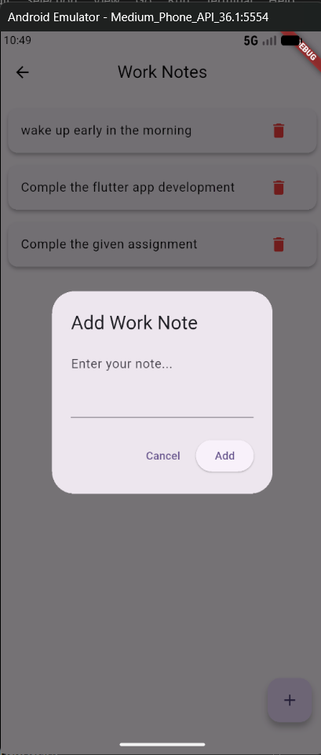

# notes-app

“The Notes App with Categories is a user-friendly mobile application built using Flutter that allows users to create, organize, and manage notes efficiently. Users can categorize their notes into different sections such as Work, Personal, or Study, making it easy to access and stay organized. The app provides a clean interface with features like adding, editing, and deleting notes, helping users keep track of important information in a structured way.”

